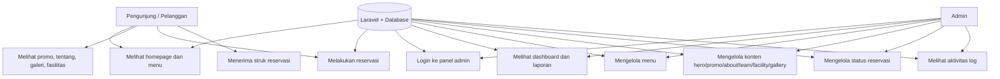
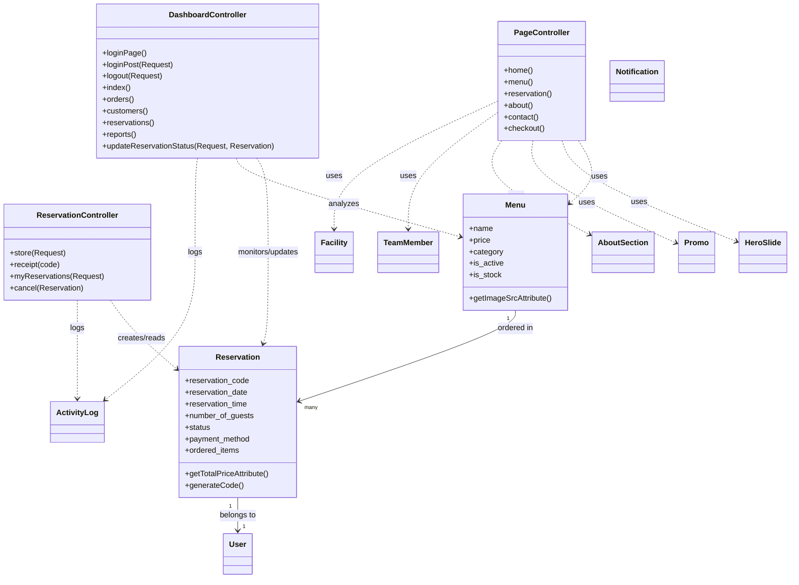
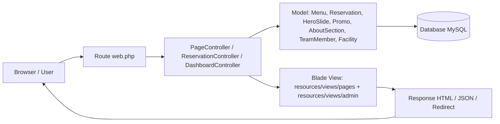

# Diagram Sistem Website Restoran Nusantara

Dokumen ini merangkum alur dari sisi front-end hingga back-end website Restoran Nusantara berdasarkan struktur route, controller, model, dan view yang ada.

## 1. Use Case Diagram



## 2. Activity Diagram — Alur Reservasi

```mermaid
flowchart TD
    A[Pengunjung membuka halaman /reservasi] --> B[Controller PageController menyiapkan data menu]
    B --> C[Pengunjung mengisi form reservasi]
    C --> D[Validasi request di ReservationController]
    D --> E{Data valid?}
    E -- Tidak --> F[Tampilkan error validasi]
    E -- Ya --> G[Ambil data menu dari database]
    G --> H[Buat record Reservation]
    H --> I[Log aktivitas ke ActivityLog]
    I --> J[Return response JSON + redirect ke receipt]
    J --> K[Pengunjung melihat halaman struk /reservasi/{code}]
```

## 3. Class Diagram (Konseptual)



## 4. Flowchart Sistem (End-to-End)



## 5. Ringkasan arsitektur

- Front-end: Blade view di resources/views/pages dan resources/views/admin.
- Backend: Laravel controller di app/Http/Controllers.
- Data layer: Eloquent model di app/Models.
- Routing: routes/web.php untuk halaman publik dan admin.
- Persistensi: database MySQL melalui migrations.
